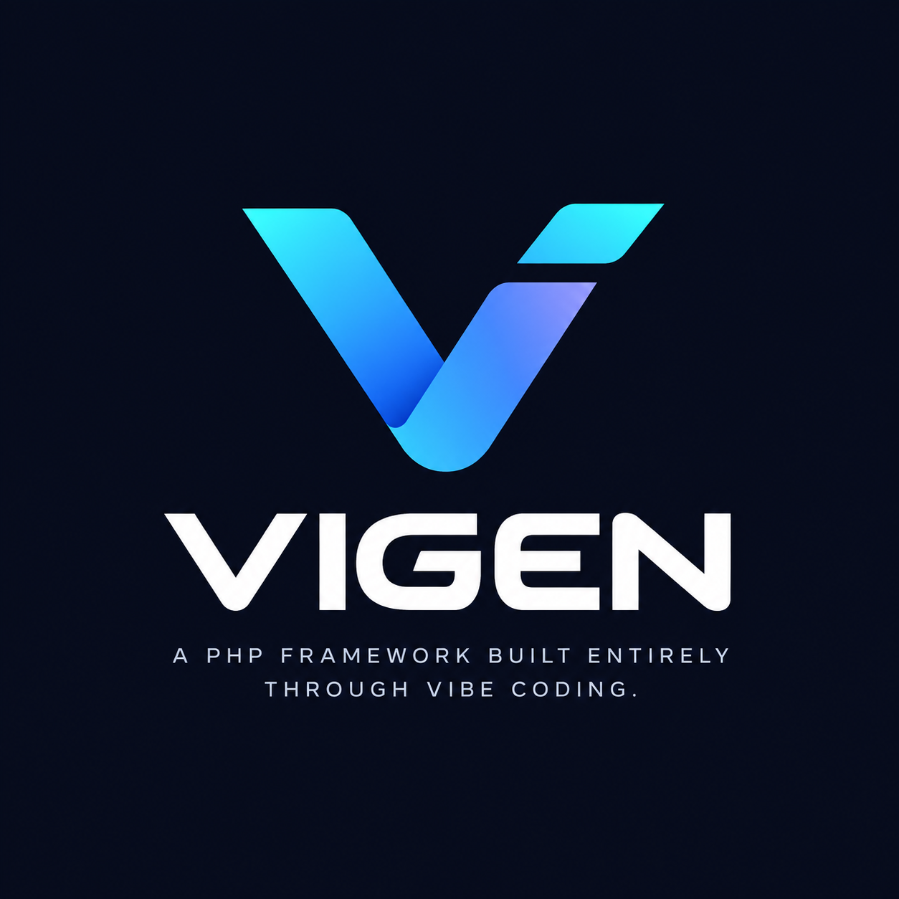

# Vigen

**Describe what you want. Vigen builds it.**

Vigen is a modern PHP framework built around AI-first development and vibe coding. Instead of hand-writing controllers, models, migrations, and routes, you describe the outcome you want and Vigen's AI engine analyzes your project, plans the change, generates or modifies the necessary files, validates the result, and fixes what it finds broken.

> Vibe. Build. Evolve.

## Quick start

### Starting a brand new project (recommended)

```bash
composer global require vigenphp/installer
vigen create my-app
cd my-app
composer install
php vigen gui                                    # if you chose GUI
php vigen chat "Create a user management system" # if you chose CLI
```

`vigen create` asks three questions - chat interface, default AI provider, and model - then scaffolds the whole project (folders, `composer.json`, `.env`, your project's own `vigen` entry point) in one go. See [vigenphp/installer](https://github.com/vigenphp/installer).

### Adding Vigen to an existing PHP project

```bash
composer require vigenphp/vigen
php vigen init
```

Composer will ask whether to trust Vigen's plugin (it publishes the `vigen` script below, nothing more):

```
Do you trust "vigenphp/vigen" to execute code and control other plugins?
```

Answer `y`, or pre-approve it in `composer.json`:

```json
"config": {
    "allow-plugins": {
        "vigenphp/vigen": true
    }
}
```

This creates a `vigen` file in your project root - your equivalent of Laravel's `artisan`. From then on:

```bash
php vigen init
```

walks you through setup:

```
Choose chat preferred:
  > CLI
    GUI

Which default AI Provider:
  > Ollama (Offline)
    OpenAI
    Claude
    Gemini

Which model to use:
  > qwen2.5-coder:14b
    qwen2.5-coder:7b
    deepseek-coder-v2:16b
    codellama:13b
```

It writes your answers to `.env` and scaffolds a fresh Vigen project (`app/`, `routes/`, `database/`, `config/`, `public/`, `resources/views/`, `.vigen/`).

- **Chose CLI?** Talk to your project directly:
  ```bash
  php vigen chat "Create a simple employee management application with employees, departments, CRUD operations, validation, and search."
  ```
- **Chose GUI?** Launch the built-in chatbox:
  ```bash
  php vigen gui
  ```
  then open `http://127.0.0.1:8808`.

Either way, no manual file creation - Vigen determines the implementation.

## Running your application

Generating code and *serving* it are different commands:

```bash
php vigen migrate   # create the tables your migrations describe
php vigen serve     # run your app at http://127.0.0.1:8808
```

`php vigen serve` used to start the chatbox; that is now `php vigen gui`. So the
loop is: `php vigen gui` to generate a feature, `php vigen serve` to use it.

Vigen's generated code targets Vigen's own runtime - `$router` in `routes/web.php`,
`Vigen\Http\Request`/`Response`, plain-PHP views in `resources/views/`,
`Vigen\Database\Model`, and `Vigen\Auth\Auth`. It is **not** Laravel: there is no
`Illuminate\`, no facades, no Eloquent, no Blade. Every generated file is parsed
before it is written, so code written against another framework is caught and
corrected rather than written out to fatal later.

> Prefer not to trust the plugin, or it didn't run (e.g. `--no-plugins`)? Run `php vendor/vigenphp/vigen/bin/vigen init` directly, or copy `vendor/vigenphp/vigen/stubs/vigen` to `./vigen` yourself. (No `vendor/bin/vigen` proxy is registered - that name belongs to the global `vigenphp/installer` command, so the two never collide.)

## Supported AI providers

- Ollama (local models, first-class)
- OpenAI
- Claude
- Gemini

Switching providers is a `.env` change - never a code change.

## CLI and GUI, one engine

```bash
vigen chat "Add authentication with login and registration"
```

The same AI engine also powers a minimal built-in GUI chatbox. Neither interface implements its own AI logic.

## Documentation

| | |
|---|---|
| [Getting started](docs/getting-started.md) | Install, init, and the serve-vs-gui loop |
| [CLI](docs/cli.md) | Every command, and how to read the output |
| [Prompting](docs/prompting.md) | What to ask for, and the API the model is given |
| [Routing](docs/routing.md) | `routes/web.php`, parameters, middleware |
| [Requests and responses](docs/requests-and-responses.md) | Input, validation, responses, sessions, errors |
| [Views](docs/views.md) | Plain-PHP templates, escaping, CSRF, form errors |
| [Database](docs/database.md) | Migrations, models, the query builder, SQLite/MySQL |
| [Authentication](docs/authentication.md) | Hash, the `Auth` guard, a complete login module |
| [Project structure](docs/project-structure.md) | Every directory, and how a request flows |
| [Configuration](docs/configuration.md) | `config/*.php` and `.env` |
| [AI providers](docs/ai-providers.md) | Ollama, OpenAI, Claude, Gemini |
| [Troubleshooting](docs/troubleshooting.md) | 404s, 419s, and "Vigen generated Laravel code" |

## Status

Vigen is in early MVP development. See `docs/` for usage documentation and `CHANGELOG.md` for progress.

## License

MIT. See `LICENSE`.


