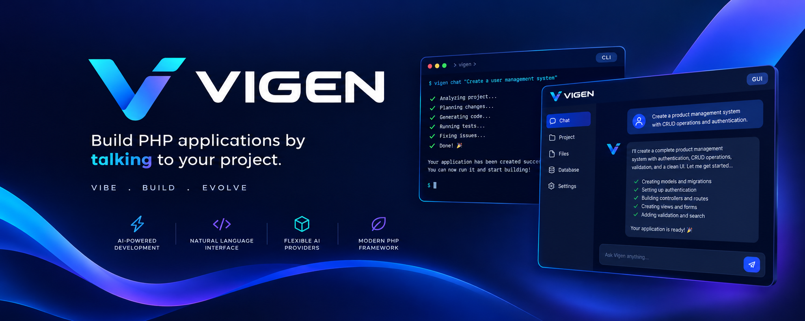

# Getting Started

1. `composer require vigenphp/vigen` - creates `./vigen` in your project root (approve the plugin prompt, or see `installation.md`).
2. Run `php vigen init` and answer three questions:
   - **Choose chat preferred:** CLI or GUI
   - **Which default AI Provider:** Ollama (Offline), OpenAI, Claude, or Gemini
   - **Which model to use:** a curated list for the provider you picked
3. Vigen writes your choices to `.env` and scaffolds a new project: `app/`, `routes/`, `database/`, `config/`, `public/`, `resources/views/` and `storage/`.
4. Start building:
   - CLI: `php vigen chat "Create a user management system"`
   - GUI: `php vigen gui`, then open the URL it prints

No manual file creation required either way - Vigen analyzes your project, plans the change, generates the files, and validates the result.

## Running your application

Generating code and *serving* it are two different commands:

| Command | What it runs |
|---|---|
| `php vigen serve` | **Your application.** Serves `public/index.php`. |
| `php vigen gui` | **The AI chatbox.** Serves the browser chat UI. |

Both bind `127.0.0.1:8808` by default, so give one of them a different port to run them together:

```
php vigen serve --port=8000
php vigen gui --port=8808
```

## Your first feature

```
php vigen init
php vigen gui                          # or: php vigen chat "create an authentication module"
php vigen migrate                      # create the tables the generated migrations describe
php vigen serve
```

Then open `http://127.0.0.1:8808` - you should see the welcome page, and `/login` and `/register` should render real forms.

If a generated route 404s, read the page: Vigen's 404 lists every route that *is* registered, which usually shows immediately that the route file the model wrote is not the one being loaded.

- **Routes** - `routing.md`
- **Requests, responses, validation** - `requests-and-responses.md`
- **Templates** - `views.md`
- **Database and models** - `database.md`
- **Login and registration** - `authentication.md`
